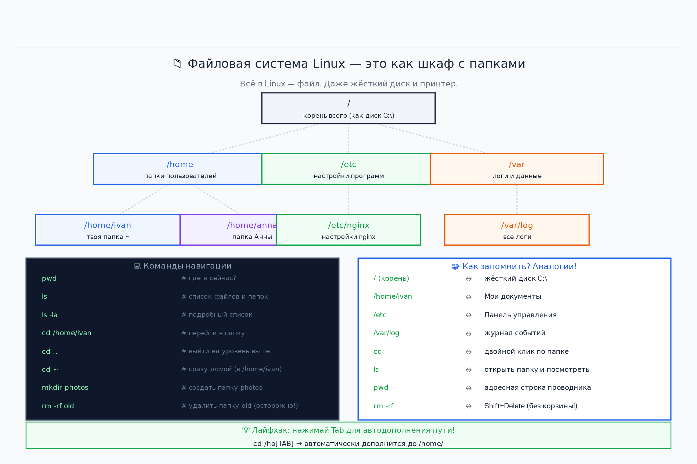
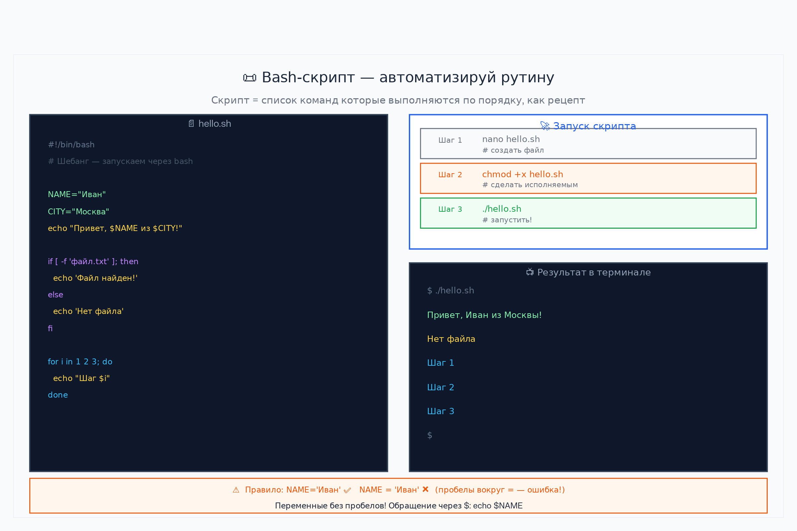
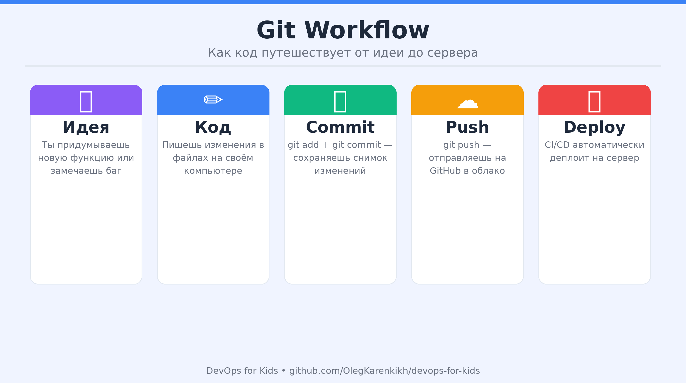
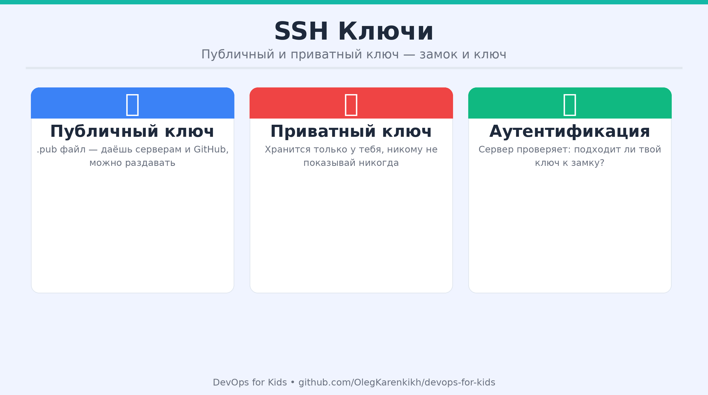
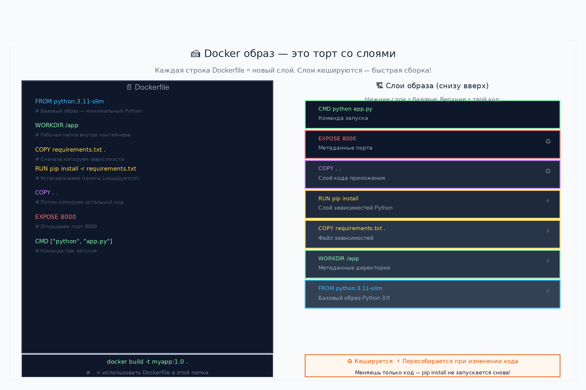
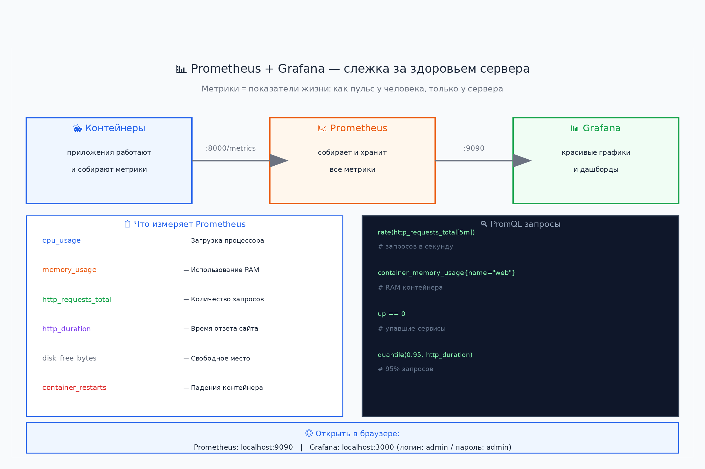
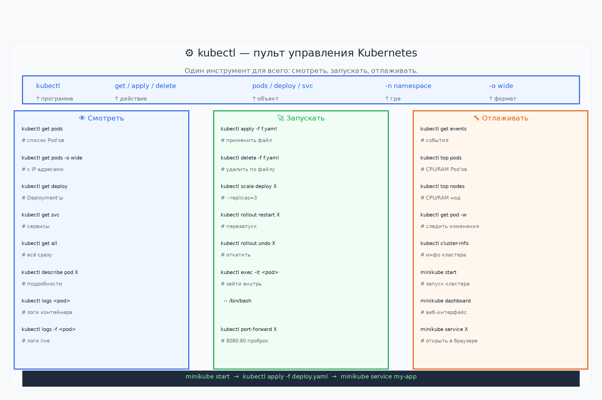
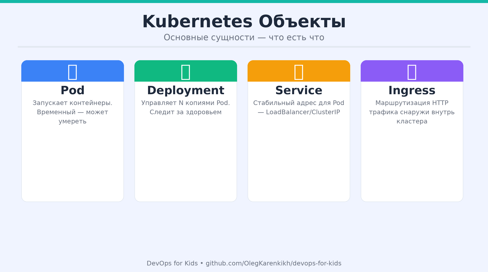
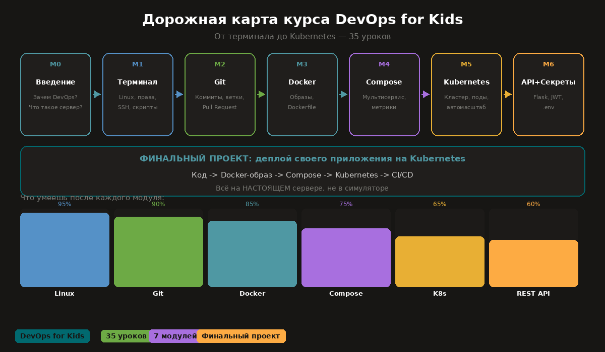

<div align="center">


# 🐧🐳⚙️ DevOps для детей и начинающих

> **Полный курс от терминала до Kubernetes** — простым языком, с иллюстрациями и задачами в терминале Linux.

[](LICENSE)
[](#-карта-курса)
[](README.md)

</div>


## 🗺️ Начни здесь — Вводный модуль

<div align="center">

<br/><em>Ты построишь именно такую систему — от нуля до продакшена</em>
</div>

**[📖 Модуль 0: Вводный — зачем это всё и как устроен мир →](lessons/module0-intro/)**

Прочитай этот модуль первым, прежде чем запускать первую команду. Здесь объясняется:
- Как работает любое приложение (три слоя)
- Что такое DevOps Pipeline и зачем он нужен
- Полный глоссарий всех терминов курса с простыми метафорами
- Как читать YAML, ENV, JSON файлы
- Порты, переменные окружения, файловая система Linux
- Психология обучения: как не бросить

---

## 🗺️ Карта курса (35 уроков)

| # | Модуль | Уроки | Что изучаем |
|---|--------|-------|------------|
| 1 | 🐧 [Терминал и Linux](lessons/module1-terminal/) | 1–8 | Команды, файлы, chmod, chown, пользователи, SSH, bash |
| 2 | 🌿 [Git и GitHub](lessons/module2-git/) | 9–11 | Версии кода, ветки, GitHub |
| 3 | 🐳 [Docker](lessons/module3-docker/) | 12–18 | Контейнеры, образы, Dockerfile, exec, logs |
| 4 | 🎼 [Compose + Мониторинг](lessons/module4-compose/) | 19–23 | Docker Compose, Prometheus, Grafana |
| 5 | ⚙️ [Kubernetes](lessons/module5-kubernetes/) | 24–28 | Pod, Deployment, Service, HPA, самовосстановление |
| 6 | 🔐 [Секреты и REST API](lessons/module6-secrets-api/) | 29–35 | .env, Flask API, SQLite, Kubernetes Secrets |

➡️ **[🏆 Итоговый проект — «Моя Коллекция»](projects/final-project/)** — применяем всё пройденное!

---

## 🚀 Быстрый старт

```bash
whoami   # Открой терминал и напиши это
```

**[👉 Начать с Урока 1 →](lessons/module1-terminal/)**

---

## 🏗️ Структура репозитория

```
devops-for-kids/
├── lessons/
│   ├── module1-terminal/      # Уроки 1–8
│   ├── module2-git/           # Уроки 9–11
│   ├── module3-docker/        # Уроки 12–18
│   ├── module4-compose/       # Уроки 19–23
│   ├── module5-kubernetes/    # Уроки 24–28
│   └── module6-secrets-api/   # Уроки 29–35
├── projects/
│   └── final-project/         # 🏆 Python + Docker + K8s
├── cheatsheets/               # Шпаргалки
├── images/                    # Иллюстрации (JPEG, ~350KB)
└── README.md
```

---

## 📖 Полезные ресурсы

| Ресурс | Что делает |
|--------|-----------|
| [play-with-docker.com](https://play-with-docker.com) | Docker в браузере |
| [killercoda.com](https://killercoda.com) | Kubernetes в браузере |
| [learngitbranching.js.org](https://learngitbranching.js.org) | Визуальный Git |

---

<div align="center">MIT License · Используй свободно, учи других! 🚀</div>

## 🖼️ Иллюстрации курса

Все схемы созданы в едином светлом стиле на русском языке.

| Модуль | Иллюстрация | Описание |
|--------|-------------|----------|
| Модуль 1 |  | Дерево каталогов Linux + аналогии с Windows |
| Модуль 1 |  | Структура скрипта: переменные, условия, циклы |
| Модуль 2 |  | Четыре зоны Git + все основные команды |
| Модуль 2 |  | Публичный и приватный ключ — замок и ключ |
| Модуль 3 |  | Dockerfile → слои образа → кеширование |
| Модуль 4 |  | Поток метрик: контейнеры → Prometheus → Grafana |
| Модуль 5 |  | Шпаргалка kubectl: смотреть / запускать / отлаживать |
| Модуль 5 |  | Pod, Deployment, Service — с примерами YAML |
| Обзор |  | Все 5 модулей и итоговый проект |

